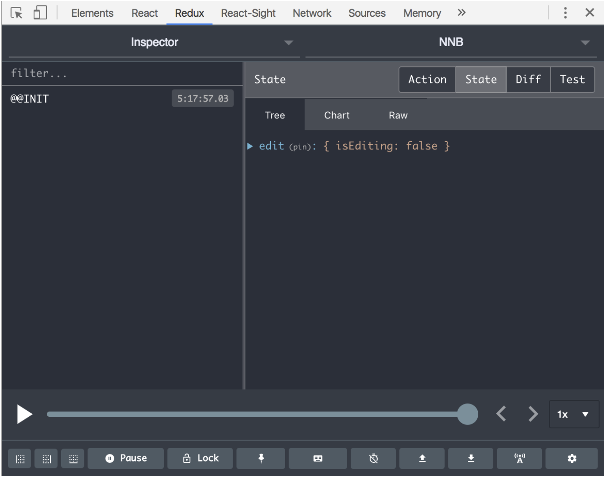

# Let's add Redux to it!

This is an example of how to use redux to go "full circle." This goes over the _how_ of redux, i.e. how to use it and start writing some redux related code. To understand the what or the why, please look [here](https://github.com/hack4impact-uiuc/wiki/wiki/Redux) \(still a WIP\).

This wiki page is based on [this PR](https://github.com/hack4impact-uiuc/nnb-frontend/pull/91/files) that adds edit mode to NNB. It mainly deals with the boolean state of `isEditing`. However, it should be fairly similar to anything else you might want to do with redux.

There are a lot of files to keep track of, but fear not, each one is fairly simple by itself.

#### 1\) Create your "slice" in the redux store

```javascript
// reducers/initialState.js
const initialState = {
  edit: {
    isEditing: false
  }
}

export default initialState
```

#### 2\) Define action types constants

```javascript
// actions/actionTypes.js
export const EDIT_MODE_ENABLED = 'EDIT_MODE_ENABLED'
export const EDIT_MODE_DISABLED = 'EDIT_MODE_DISABLED'
```

The purpose of explicitly declaring constants is so that we can reference the action types via a variable as opposed to a string value. This helps us ensure that typos get caught by compiler or runtime errors instead of causing spooky, hard to find bugs.

#### 3\) Create action creators

`Note`: anywhere `<>` is used, you should replace it with the thing you're trying to add. In this example, it will be `edit`.

```javascript
// actions/<>.action.js
import * as actionTypes from './actionTypes'

function editModeEnabled() {
  return { type: actionTypes.EDIT_MODE_ENABLED, payload: true }
}

function editModeDisabled() {
  return { type: actionTypes.EDIT_MODE_DISABLED, payload: false }
}
```

Recall that an action is simply an object that contains a `type` and a `payload`. An action creator is a simply a function that creates an action. \(how insightful varun...\)

`Note`: the action creator should be called the same thing as its corresponding action, but in camelCase.

#### 4\) Create action dispatcher functions

```javascript
// actions/<>.action.js
// action creators above

export function enableEditMode() {
  return dispatch => dispatch(editModeEnabled())
}

export function disableEditMode() {
  return dispatch => dispatch(editModeDisabled())
}
```

These should return functions that dispatch your actions. Dispatching actions is what "fires" them, which will then let redux know internally that a reducer should pick it up to process them.

This example is very basic since all the `enableEditMode` function needs to do is fire the `EDIT_MODE_DISABLED` action. The important thing to account for is _when_ you should `dispatch`your actions.

For example, if you are making an asynchronous API request, you will want to `dispatch` the action _after_ you receive your response. For an API request that corresponds to a `MAPS_RECEIVED` action, it might look something like:

```javascript
  return dispatch => {
    return Api.getMaps().then(maps => dispatch(mapsReceived(maps)))
  }
}
```

#### 5\) Re-export action dispatcher functions

```javascript
// actions/index.js
import { enableEditMode, disableEditMode } from './edit.action'

export { enableEditMode, disableEditMode }
```

This will simply make all the action dipatcher functions available to import elsewhere in the app.

#### 6\) Create reducer

```javascript
// reducers/<>.reducer.js

import initialState from './initialState'
import { EDIT_MODE_ENABLED, EDIT_MODE_DISABLED } from '../actions/actionTypes'

export default function edit(state = initialState.edit, action) {
  switch (action.type) {
    case EDIT_MODE_ENABLED:
    case EDIT_MODE_DISABLED:
      return {
        ...state,
        isEditing: action.payload
      }
    default:
      return state
  }
}
```

Recall that a reducer is simply a _pure_ function `f(currentState, action) => nextState`.

**IMPORTANT**: Given the type of action, it's job is to return what the next app state should look like. It's _very important_ that you maintain that this function is _pure_, i.e. it does NOT mutate the state, and does NOT cause side effects. Read more [here](https://medium.freecodecamp.org/why-redux-needs-reducers-to-be-pure-functions-d438c58ae468).

Here we are making use of the [spread operator](https://redux.js.org/recipes/using-object-spread-operator) to make a new copy of the state object. This syntax allows us to concisely create a new, unmutated copy of the state object and change the specified keys.

The `switch` statement above makes use of the [fall through feature](https://stackoverflow.com/questions/13207927/switch-statement-multiple-cases-in-javascript).

#### 7\) Add reducer to rootReducer

```javascript
// reducers/rootReducer.js
import { combineReducers } from 'redux'
import edit from './edit.reducer'

const rootReducer = combineReducers({
  edit
})

export default rootReducer
```

If the `rootReducer` already exists, just import your reducer and add it to the object given to `combineReducers`.

#### 8\) Create a component and its corresponding container component

Read this post about [Presentational \(Dumb\) Components and Container \(Smart\) Components](https://medium.com/@dan_abramov/smart-and-dumb-components-7ca2f9a7c7d0)from the creator of redux. Essentially, container components deal with the app _logic_ and app state, whereas presentational components deal with rendering views \(JSX/DOM\). Splitting them into the two allows for better separation of concerns.

Presentational Component:

```javascript
import React, { Component } from 'react'

export default class Edit extends Component {
  render() {
    const { isEditing, enableEditMode, disableEditMode } = this.props
    return (
      <div>
        <button onClick={isEditing ? disableEditMode : enableEditMode}>
          {isEditing ? 'disableEditMode' : 'enableEditMode'}
        </button>
      </div>
    )
  }
}
```

This should look like a very standard react component that you are familiar with. But where are its props coming from? Find out below! \(like legit right under this line\)

Container:

```javascript
components/<>.container.js

import { connect } from 'react-redux'
import { bindActionCreators } from 'redux'
import { enableEditMode, disableEditMode } from './../actions'
import Edit from './Edit.component'

function mapStateToProps(state) {
  return {
    isEditing: state.edit.isEditing
  }
}

function mapDispatchToProps(dispatch) {
  return bindActionCreators(
    {
      enableEditMode,
      disableEditMode
    },
    dispatch
  )
}

export default connect(mapStateToProps, mapDispatchToProps)(Edit)
```

This is where a couple new things are added:

* `mapStateToProps` lets you pick which parts of the app state you want to send into the presentational component as props
* `mapDispatchToProps` lets you pick which action dispatcher functions you want to send into the presentational component as props

This paradigm allows every component to only care about exactly what it needs \(props\) and what it does \(action dispatcher functions\).

#### 9\) Check if everything is tied together!

Install the [redux devtools browser extension](https://github.com/gaearon/redux-devtools) if you haven't already:

* [Chrome](https://chrome.google.com/webstore/detail/redux-devtools/lmhkpmbekcpmknklioeibfkpmmfibljd) 
* [Firefox](https://addons.mozilla.org/en-US/firefox/addon/remotedev/)

The redux devtools are hella dope, but it's also a reflection of how dope redux itself is.

When you start the app, your store should look something like this:



Notice that it's a reflection of your `initialState`.

Click the button in the `Edit` component and watch the state update:


You can also see exactly what changed in the `diff` tab:


**AND** you can time travel! Click the arrows in the timeline to rewind and replay the actions! Ain't that **HELLA DOPE**???

#### Redux Data Flow

Here is what the data flow looks like for this example:

1. click the button defined in the `Edit` component
2. the button's `onClick` will call the `enableEditMode` action dispatcher function
3. this dispatches the `EDIT_MODE_ENABLED` action
4. the action gets picked up by the edit reducer
5. the edit reducer decides what the next state should be given the current state and the action
6. the store is updated with the next state the reducer returns
7. the new state is delivered to the container/component as props

The cool thing is that this flow will look basically the same for _any_ other feature. Once you get the hang of this, it will be much easier to develop more complicated features yet still maintain readability and minimize complexity!

